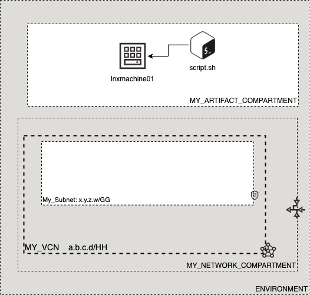

# OCI Cloud Bricks: Remote Linux Executor

[](https://img.shields.io/badge/license-UPL-green) [](https://sonarcloud.io/dashboard?id=oracle-devrel_terraform-oci-cloudbricks-remote-linux-executor)

## Introduction
The following cloud brick enables you to execute a bash script on IaaS instances and pass on parameters for simple Configuration Management tasks

## Reference Architecture
The following is the reference architecture associated to this brick


Script can be executed in as many machines as required. A wrapper script can be used in case more than one script is in place. 

### Prerequisites
- Pre existent compute instance where to run the script
- A pre-tested script. The script must be self contained and take in consideration all of potential pre-requisites to be ran in a one-time way

---
## Sample tfvar file
```shell
########## SAMPLE TFVAR FILE ##########
########## PROVIDER SPECIFIC VARIABLES ##########
ssh_public_key      = "./ssh_keys/auto_ssh_id_rsa.pub"
ssh_private_key     = "./ssh_keys/auto_ssh_id_rsa"
ssh_public_is_path  = true
ssh_private_is_path = true
script_name         = "./scripts/somescript.sh"
script_args         = "arg1 arg2"
########## PROVIDER SPECIFIC VARIABLES ##########
########## SAMPLE TFVAR FILE ##########
```
## Variable specific considerations
- Script may be located in any place, however recommended place is inside the same implementation under directory *scripts*
- Variable `script name` must contain either the full absolute or relative path combined with the name of the script
- If script expects arguments, these should be passed on via variable `script_args` separated by spaces. 
  - As many arguments as required can be passed through this variable in the order the script requires them

---
## Sample provider
The following is the base provider definition to be used with this module

```shell
terraform {
  required_version = ">= 0.13.5"
}
provider "oci" {
  region       = var.region
  tenancy_ocid = var.tenancy_ocid
  user_ocid        = var.user_ocid
  fingerprint      = var.fingerprint
  private_key_path = var.private_key_path
  disable_auto_retries = "true"
}

provider "oci" {
  alias        = "home"
  region       = data.oci_identity_region_subscriptions.home_region_subscriptions.region_subscriptions[0].region_name
  tenancy_ocid = var.tenancy_ocid  
  user_ocid        = var.user_ocid
  fingerprint      = var.fingerprint
  private_key_path = var.private_key_path
  disable_auto_retries = "true"
}
```
---

## Requirements

No requirements.

## Providers

| Name | Version |
|------|---------|
| <a name="provider_null"></a> [null](#provider\_null) | 3.1.0 |

## Modules

No modules.

## Resources

| Name | Type |
|------|------|
| [null_resource.remote_executor](https://registry.terraform.io/providers/hashicorp/null/latest/docs/resources/resource) | resource |

## Inputs

| Name | Description | Type | Default | Required |
|------|-------------|------|---------|:--------:|
| <a name="input_linux_compute_private_ip"></a> [linux\_compute\_private\_ip](#input\_linux\_compute\_private\_ip) | Private IP of Compute | `any` | n/a | yes |
| <a name="input_script_args"></a> [script\_args](#input\_script\_args) | Arguments that are passed on to the script | `any` | `null` | no |
| <a name="input_script_name"></a> [script\_name](#input\_script\_name) | Name of .sh script | `string` | `"script.sh"` | no |
| <a name="input_ssh_private_is_path"></a> [ssh\_private\_is\_path](#input\_ssh\_private\_is\_path) | Describes if SSH Private Key is located on file or inside code | `bool` | `false` | no |
| <a name="input_ssh_private_key"></a> [ssh\_private\_key](#input\_ssh\_private\_key) | Private key to log into machine | `any` | n/a | yes |
| <a name="input_ssh_public_is_path"></a> [ssh\_public\_is\_path](#input\_ssh\_public\_is\_path) | Describes if SSH Public Key is located on file or inside code | `bool` | `false` | no |
| <a name="input_ssh_public_key"></a> [ssh\_public\_key](#input\_ssh\_public\_key) | Defines SSH Public Key to be used in order to remotely connect to compute instance | `string` | n/a | yes |

## Outputs

No outputs.

## Contributing
This project is open source.  Please submit your contributions by forking this repository and submitting a pull request!  Oracle appreciates any contributions that are made by the open source community.

## License
Copyright (c) 2021 Oracle and/or its affiliates.

Licensed under the Universal Permissive License (UPL), Version 1.0.

See [LICENSE](LICENSE) for more details.
